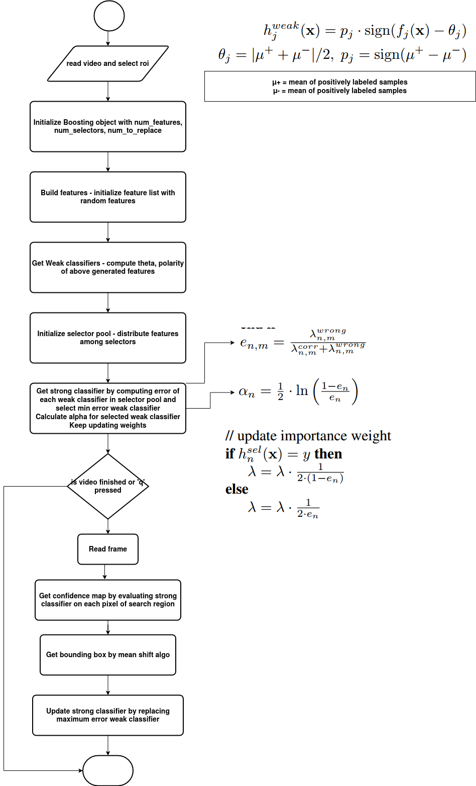

### Algo:

**main**
* video_path, opencv cap, videoWriter, ask for roi
* #rows = `N`
* #col or #features = `F`
* #selectors = `S`
* #weak_clf_to_replace = `R`
* initialize Boosting object (`bo`)
* `bo`.build_features ==> # feature_list gets initialized with random Haar features
* `bo`.get_weak_classifiers() ==> # compute theta, polarity of above generated features
* `bo`.init_selector_pool() ==> # distribute features among selectors
* `bo`.get_strong_classifier() ==> # get strong classifier for each selector
* 
* LOOP till q pressed or video finished:
  * read frame
  * `bo`.get_confidence_map()
  * `bo`.get_bbox()
  * `bo`.update_strong_classifier()
  * 

**class Boosting**
* __init__(frame, roi, N, F, S, R) ==> init blue rect

* build_features() ==> 
  * LOOP 1 to F:
    * choose random feature (Haar / LBP / Histogram) # currently only using Haar
    * choose random type (if Haar then specify kernel type and scale)
    * feature_list = list of features
    * feature_info = {feature_id: {meu+: , meu-: , theta: , polarity: , alpha: , error: , lambda_wrong: , lambda_corr: , selector_index: }, ......}

* get_weak_classifiers() ==> 
  * get_training_data() # initialize training_data with images and corresponding label (1 or -1)
  * init_sample_weights() # assign weights to each training sample
  * compute each feature from feature list on each training sample
  * calculate meu+, meu-, polarity, theta

* init_sample_weights() ==> 
  * assign 1 to all training sample (X[i])

* init_selector_pool() ==>
  * LOOP 1 to S:
    * choose random (previously unselected) feature from feature_list
  
* get_strong_classifier() ==> 
  * LOOP 1 to S:
    * compute error of all features of that selector
    * select min error feature
    * calculate alpha of that feature
    * append to strong clf
    * update weights of sample (lambda)

* get_confidence_map() ==> 
  * eval strong clf on every pixel of blue rect

* get_bbox() ==> 
  * mean_shift on confidence_map

* update_strong_clf() ==>
  * LOOP 1 to R:
    * get max error feature from strong clf
    * compute all features of that selector's pool on new blue rect
    * compute meu+, meu-, theta, polarity
    * compute error
    * select min error feature and add to strong clf

### Doubts / Things to try:

* random location samples or fix location by specifying white and black region coords
* update strong classifier logic (only replace or get min error feature for all selector)
* meu+, meu- from kalman filter or not