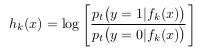
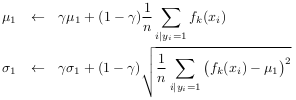

# MILBoost
## ALGO
**main**
* videopath, opencv cap, roi
* intitalize MIL class object (tracker)
* tracker.generate_features()
* tracker.update_bags()
* tracker.initialize_feature_values()
* tracker.get_strong_clf()
* LOOP till q pressed or video finished:
    * read frame
    * new roi = get_new_position()
    * tracker.update_bags()
    * tracker.update_feature_values()

**class Feature (eg:-Haar)**
* Gaussian Parameters :
    * `meu_plus`: average of feature on image patches in positive bag.  
    * `meu_minus`: average of feature on image patches in negative bag.
    * `sigma_plus`: standard deviation of feature on image patches in positive bag.
    * `sigma_minus`: standard deviation of feature on image patches in negative bag.

**class MIL**
* `K` : number of chosen weak classifiers
* `M` : number of candidate weak classifiers
* `generate_features()` ==>
    * generate and shortlist `M` features (haar features of type 2-4)  
* `update_bags()` ==>
    * Crop out two sets of image patches
    * l(t) ==> roi patch center at time t
    * l(x) ==> center of some image patch 
        * Positive Bag ==> X(r) = {x : || l(x) - l(t) || < `r`} and 
        * Negative Bag ==> X(r,β) = {x : `r` < || l(x) − l(t) || < `β`}.
* `initialize_feature_values` ==>
    * set parameters(`meu_plus` , `meu_minus` , `sigma_plus` , `sigma_minus`) of all the features according to the image patches in the positive and negative bags.
* `get_strong_clf()` ==>
    * LOOP 1 to `K`:
        * compute weighted error of all the features 
        * select min error feature
        * calculate alpha of that feature
        * append to strong clf
        * update weights of samples (lambda)
* `get_new_position` ==>
    * For each new frame we crop out a set of image patches that are within some search radius s of the current tracker location, and compute p(y|x) for all x ∈ X s . We then use a greedy strategy to update the tracker location:
                        
                X(s) = {x : || l(x) − l(t−1) || < s}                    
                l(t) = l(argmax p(y|x))  (x in X(s)) 
                p(y|x)=sigmoid(H(x))
    * The classifiers
return the log odds ratio

        

* `update_feature_values()` ==>
    * When the weakclassifier receives new data {(x 1 , y 1 ), . . . , (x n , y n )} we use the following update rules:

        
    
    where 0 < γ < 1 is a learning rate parameter. The update rules for μ0 and σ0 are similarly defined.

## References
1. http://vision.ucsd.edu/~bbabenko/data/miltrack-pami-final.pdf
2. https://www.sciencedirect.com/science/article/abs/pii/S0925231216300364