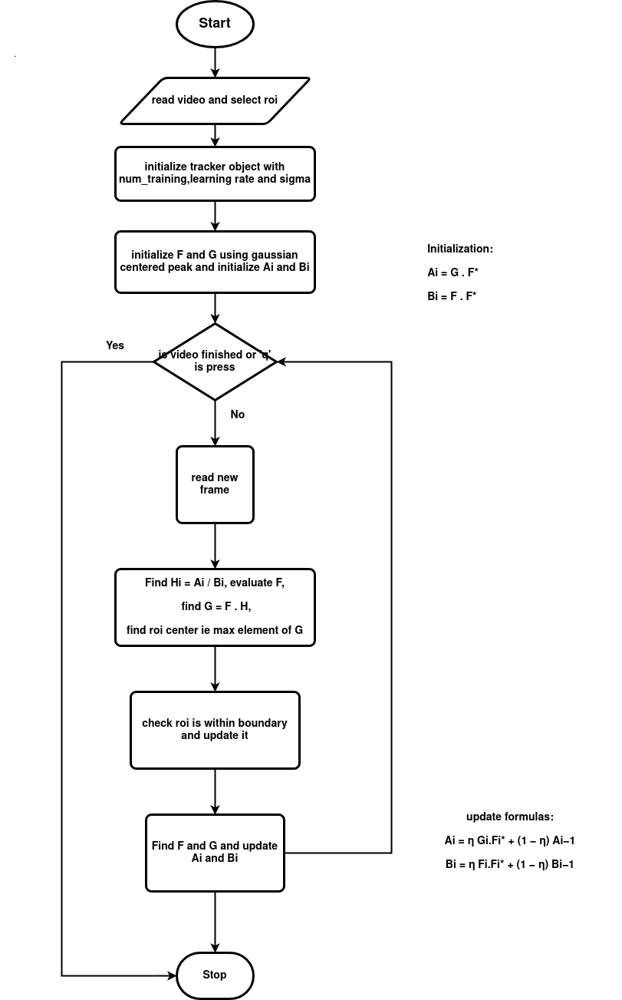

### INTRODUCTION

Aim is to implement the MOSSE tracker algorithm

## Demo

### FLOW CHART

### ALGO

**main**
* videopath, ask for roi
* #training examples = `train_num`
* #sigma for gaussian response = `sigma`
* #learning rate = `learning_rate`
* intialize MOSSE object (`tracker`)
* `tracker`.pre_training
* 
* LOOP till q is pressed OR video is finished:
    * read frame
    * `tracker`.update_frame
    * `tracker`.new_roi
    * check new roi is within frame boundary
    * `tracker`.update_roi
    * `tracker`.update

**Class MOSSE**
* __init__(frame,roi,learning_rate,train_num,sigma)

* pre_training() --> 
    * initialize `F` --> using preprocessing()
    * initialize `G` --> using get_gaussian_response()
    * `Ai` = `G` * `F`*
    * `Bi` = `F` * `F`*
    * LOOP over `train_num`:
        * `F` using get_rand_affine()
        * calculate `Ai` and `Bi`

* get_new_roi() -->
    * `Hi` = `Ai`/ `Bi`
    * `F` --> using preroceesing()
    * `G` = `F` * `H`
    * find new roi center ie max element of `G`

* update() --> 
    * `F` --> using preprocessing()
    * `G` --> using gaussian_response()
    * update `Ai` and `Bi`

* get_gaussian_map() --> 
    *  `c_x c_y` --> center of roi
    * `g(x,y)` = e-((x-c_x)2+ (y-c_y)2)/sigma2
    * normalize `g`

* preprocessing() -->
    * img = log(img+1)
    * normalize `img` to mean value 0.0 and norm 1.0
    * calculate and apply cosine window

### TODO:
1. Tuning the hyperparameters
2. Occulsion handling using PSR values

### REFERENCES:
1. https://www.researchgate.net/publication/221362729_Visual_object_tracking_using_adaptive_correlation_filters
2. https://github.com/TianhongDai/mosse-object-tracking