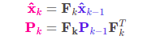
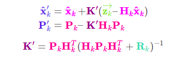

## ALGO
### main
* video_path, opencv cap, videoWriter
* initialise SORT object tracker
* LOOP till q pressed or video finished :
    * using YOLO or other object detectors detect a particular class of objects with probability > 50% and store it in `detections`
    * current_trackers = call **update()** function of class sort which returns an **updated list of trackers**. 
    * plot the bounding boxes from the list of current_trackers on the frame.
    * display the frame.

**class** `Kalman Tracker` :
* **init**(`self`,`bbox`) ==> initialise tracker variables

* **predict**(`self`)
    * implement following equations :   
    
    * if `self.age` > 1
        * `self.hit_streak` = 0

* **update**(`self`,`bbox`)
    * `self.age` = 0
    * `self.hit_streak` += 1
    * implement the following equations :   
    
  
**class** `sort` :
* **_init_**(`self`,`max_age`,`min_hits`,`iou_threshold`) ==> initialise hyperparameters like `age` and `iou_threshold`

* **update**(`self`,`detections`) ==>
    * increment `self.frame_count`
    * initialise new list of trackers. 
    * call **predict()** of Kalman Tracker on each tracker in `self.trackers` 
    * call **associate_detections()** which returns `matched detections`, `unmatched detections`, and `unmatched trackers`.
    * for all `matched detections` :
        * add tracker to new list of trackers.
        * run **update()** of class Kalman Filter class on all the associated trackers on the new measurement.
    * for all `unmatched_detections` :   
        * create and initialise new tracker.
        * add the tracker to the trackers list.
    * for all unmatched_trackers :
        * increment `age` of the tracker.
        * remove tracker for whom `age` > `max_age` from the trackers list.
    * `self.trackers` = new list of trackers.
    * current_trackers = list of all trackers from self.trackers whose `age` < 1 and ( `hit_streak` > `min_hit` or self.`frame_count` < `min_hits`. 
    * return `current_trackers`.

## References :
1. https://arxiv.org/pdf/1602.00763.pdf
2. https://github.com/abewley/sort
3. https://www.bzarg.com/p/how-a-kalman-filter-works-in-pictures/
4. https://filterpy.readthedocs.io/en/latest/kalman/KalmanFilter.html
5. https://www.kalmanfilter.net/kalman1d.html
